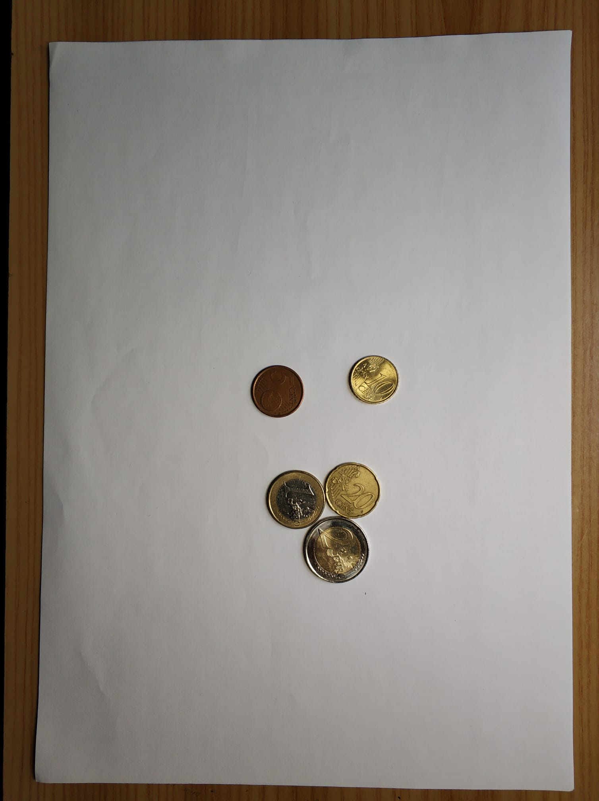

# EURO-Coin-Detector
This repository aims to build a fully automated Euro coin detector. It's still a WIP, so if you have any ideas or recommendations, I am opened to listening to them.

## Selecting the area

Homography is used to warp the image and get only the ROI. For that, the coins must be on a A4 paper.

The distribution of the coins does not matter (they can be together). My algorithms detects the borders of the paper and transforms it into a cropped and stretched image of it.

### Original Image

### Warped Image

### Explanation
- First the white papersheet is detected and the image is warped according to the A4 proportions. This can be found in `areaSelector.py`.
- Secondly, the coins are isolated from the white background using the watershed algorithm and then saved individually. `coinDetector.py`.
  
### Results after detecting coins
My algorithm will output a cropped image of each coin:

    

## Coin Detection - Dataset (WIP)

I tried a dataset from:
https://github.com/Pitrified/coin-dataset

But still some preprocessing is needed to isolate the coins the same way my algorithm do and not have a green background for example.

With this data and the raw input of the dataset, the ANN doesn't perform very well with the coins obtained by my algorithm.

You can find the code in Jupyter Notebooks in the folder `notebooks` (`testANN` and `trainANN`).

## How to use
Run firstly `areaSelector.py` and then `coinDetector.py`. See _ main _ of both to configure.

## References
I used some software already developed or I was inspired by:
- https://docs.opencv.org/3.4/d3/db4/tutorial_py_watershed.html
- https://learnopencv.com/homography-examples-using-opencv-python-c/
- https://github.com/SuperDiodo/euro-coin-dataset/