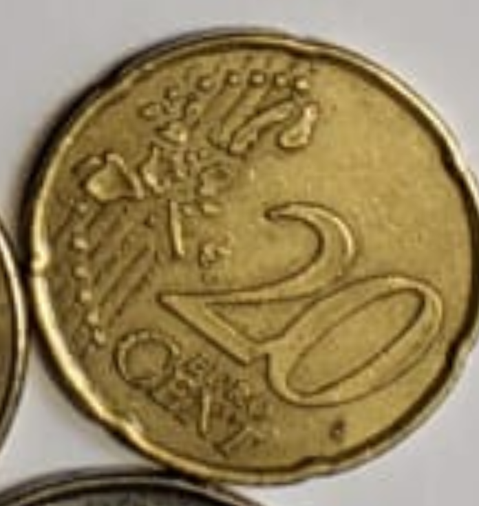

# EURO-Coin-Detector
This repository aims to build a fully automated Euro coin detector.

## Selecting the area

Homography is used to warp the image and get only the ROI. For that, the coins must be on a A4 paper.

The distribution of the coins does not matter (or at least it shouldn't). My algorithms detects the borders of the paper and transforms it into a cropped and stretched image of it.

### Original Image

### Warped Image

## Coin Detection - Dataset

This is the point of the project  which needs more work now. I have only been able to find one small euro coin dataset. Therefore I ask the community to participate in the creation of a bigger one by sending me pictures following these instructions:
- Coins on top of a A4 paper.
- Only one type of coin per picture.
- The coins may be separated or together.
- Different angles of the same paper (orthogonal and more oblicuous perspectives) are accepted.
- Name of the file: X.y.png (X = amount; y = c / e for cent or euro).

For example a photo of 20 cents pictures should ONLY have 20 cents coins on an A4 paper and should be called "20.c.png".
As reference see the picture below.

Please send the pictures to miguelgranero99@gmail.com

Thank you for participating!

### Results after detecting coins
My algorithm will output a cropped image of each coin:

    

## References
I used some software already developed or I was inspired by:
- https://docs.opencv.org/3.4/d3/db4/tutorial_py_watershed.html
- https://learnopencv.com/homography-examples-using-opencv-python-c/
- https://github.com/SuperDiodo/euro-coin-dataset/
